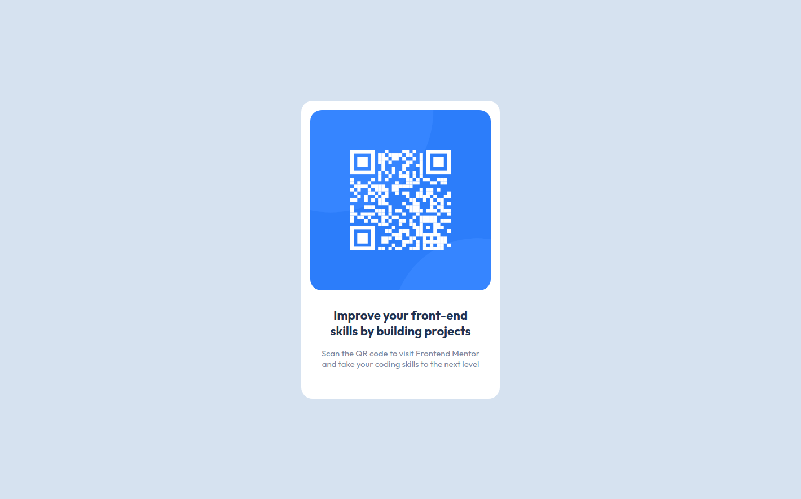

# Frontend Mentor - QR code component solution

This is a solution to the [QR code component challenge on Frontend Mentor](https://www.frontendmentor.io/challenges/qr-code-component-iux_sIO_H). Frontend Mentor challenges help you improve your coding skills by building realistic projects.

## Table of contents

- [Overview](#overview)
  - [Screenshot](#screenshot)
  - [Links](#links)
- [My process](#my-process)
  - [Built with](#built-with)
  - [Continued development](#continued-development)
- [Acknowledgments](#acknowledgments)

## Overview

### Screenshot

<em><b>Mobile Design</em></b>

  

<em><b>Desktop Design</em></b>

  

### Links

- Solution URL: [Github](https://github.com/retop56/FrontendMentor---QR-code-component)
- Live Site URL: [Result](https://retop56.github.io/FrontendMentor---QR-code-component/)

## My process

### Built with

- Semantic HTML5 markup
- CSS custom properties
- Flexbox
- Mobile-first workflow

### Continued development

- Need to keep working with flexbox to get a better grasp of it.

- Need more practice getting images to stay within a div container.

## Acknowledgments

Shoutout to Frontend Mentor for providing this great project!
